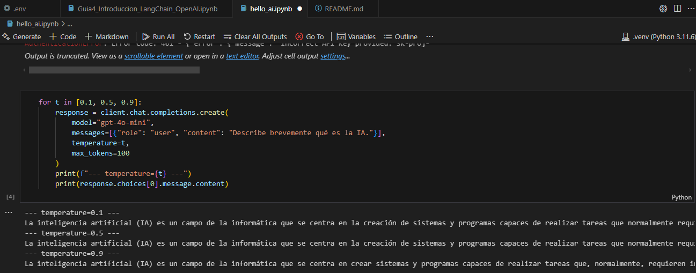
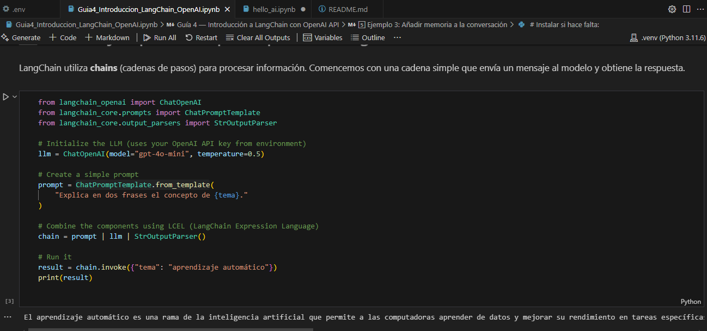
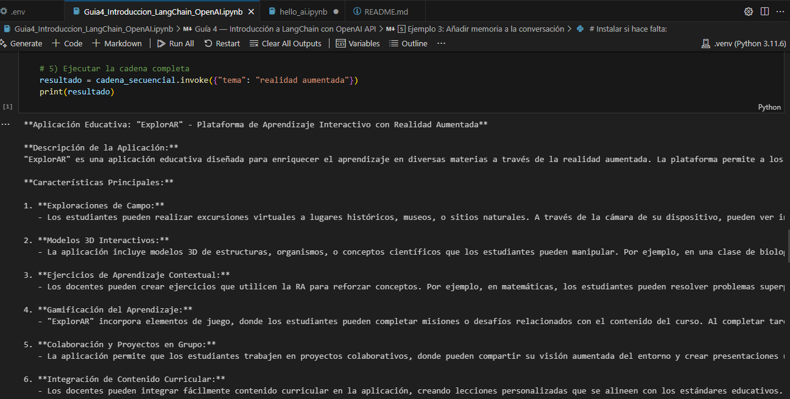

# Tutorial LangChain

Este proyecto es una guía práctica para aprender a utilizar **LangChain** con la API de OpenAI. Incluye ejemplos de configuración, creación de cadenas de prompts, manejo de memoria y generación de contenido educativo. Está diseñado para usuarios interesados en desarrollar aplicaciones impulsadas por LLMs.

## Arquitectura del Proyecto

El proyecto está organizado en varios notebooks que cubren diferentes aspectos del uso de LangChain y OpenAI:

1. **`Guia3_IntroAPIsAI_Notebook.ipynb`**:
   - Introducción a las APIs de OpenAI.
   - Configuración inicial del cliente OpenAI.
   - Ejemplos básicos de generación de texto con parámetros como `temperature`, `max_tokens`, y `top_p`.

2. **`Guia4_Introduccion_LangChain_OpenAI.ipynb`**:
   - Introducción a LangChain.
   - Creación de cadenas de prompts (`Prompt Chains`).
   - Uso de memoria para mantener contexto en conversaciones.
   - Ejemplos de flujos secuenciales y generación de contenido educativo.

3. **`hello_ai.ipynb`**:
   - Ejercicios prácticos para interactuar con modelos de lenguaje.
   - Generación de texto creativo y respuestas a preguntas específicas.


4. **`setup_hello_ai.ipynb`**:
   - Instalación de dependencias necesarias para el proyecto.
   - Configuración del entorno virtual y carga de claves API.

## Requisitos Previos

- Python 3.10 o superior.
- Cuenta en OpenAI con una clave API válida.
- Editor de código como Visual Studio Code o Jupyter Notebook.

## Instalación

Sigue estos pasos para configurar el proyecto:

1. **Clonar el repositorio**:
   ```bash
   git clone https://github.com/thesrcielos/ArepLLMTutorial
   cd ArepLLMTutorial

2. **Crea un entorno virtual**:
```bash
python -m venv .venv
source .venv/bin/activate  # En Windows: .venv\Scripts\activate
pip install jupyter ipykernel
python -m ipykernel install --user --name ArepLLMTutorial
```

3. **Configurar las variables de entorno**: 
Crea un archivo .env en la raíz del proyecto con el siguiente contenido:
```
OPENAI_API_KEY=tu_api_key
```

4. **Abrir los notebooks**: 

Abre los archivos .ipynb en tu editor preferido (por ejemplo, Jupyter Notebook o VSCode).

5. **Ejecutar los notebooks**: 

Sigue las instrucciones dentro de cada notebook para explorar los ejemplos y realizar las prácticas.

## Ejemplos Ejecuciones
Distintas Temperaturas

Prompt simple con LangChain

Encadenar múltiples pasos

